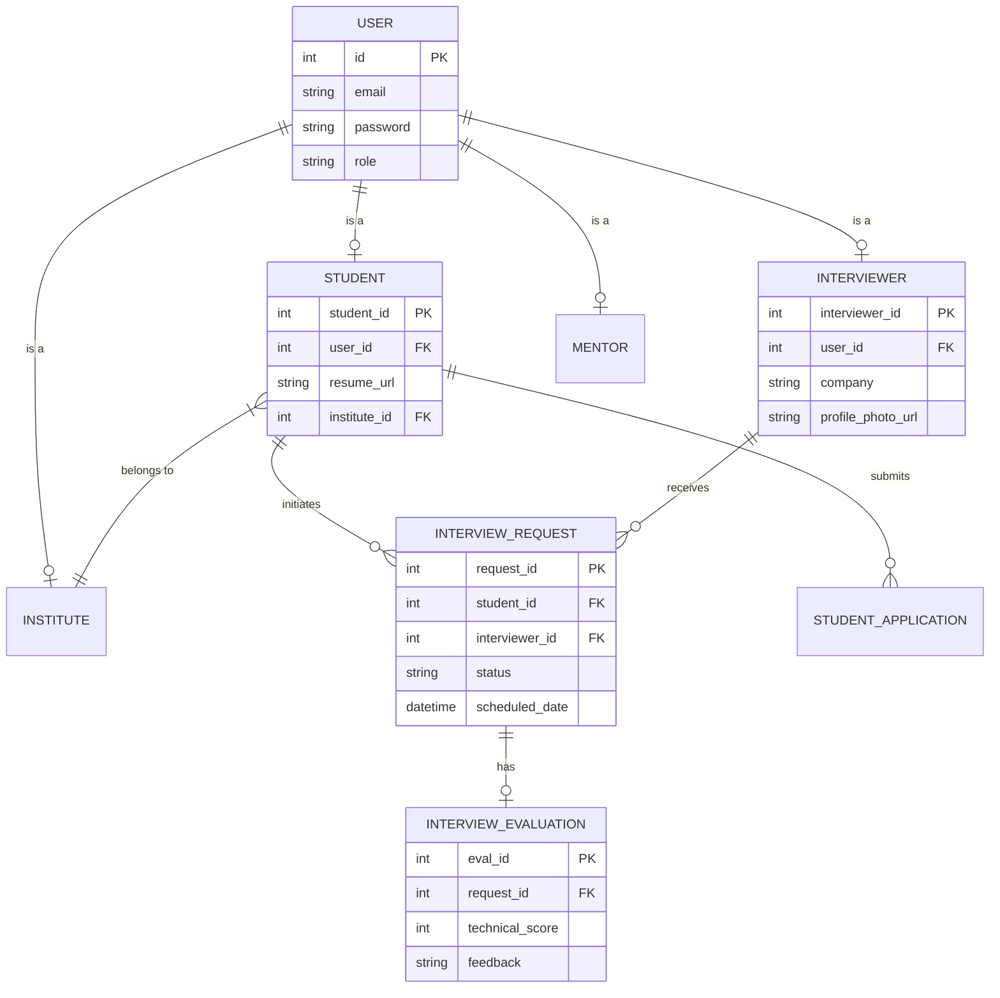
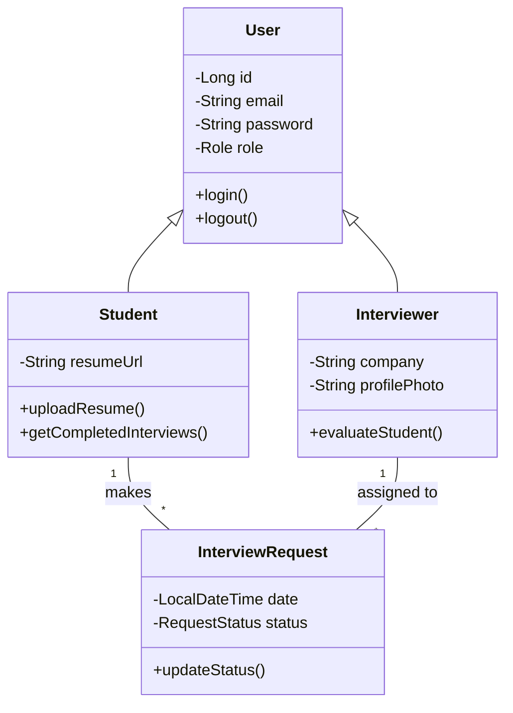
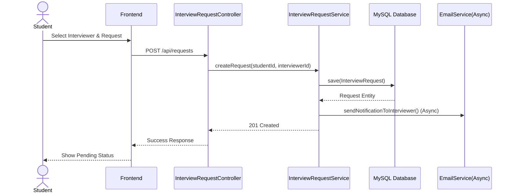
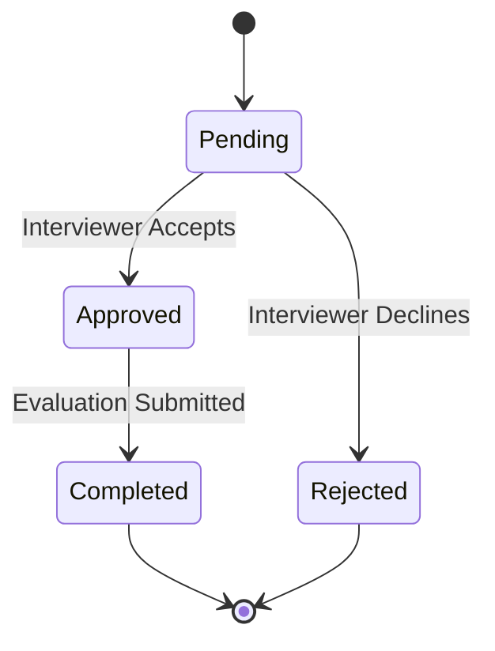

# Comprehensive Project Documentation: Interview Platform

## Executive Summary & Abstract
The Interview Platform is a comprehensive, full-stack web application designed to bridge the gap between academic institutions, students, and industry professionals. The primary objective of this project is to streamline the mock interview and evaluation process, providing a centralized ecosystem for scheduling, conducting, and tracking technical and HR interviews. Key functionalities include role-based dashboards (Admin, Institute, Mentor, Interviewer, Student), automated email notifications via asynchronous processing, persistent file storage for resumes and profiles, and detailed analytics for completed interviews. Targeted at educational institutions and professional training centers, the expected outcomes include reduced administrative overhead, enhanced student preparedness, and robust tracking of student progress. The technology stack comprises a Spring Boot backend, a modern JavaScript frontend (React/Vanilla JS), MySQL for relational data management, and JWT-based secure authentication, all deployable to cloud platforms like Railway and AWS.

---

## 1. Company Profile
**Organization:** Educational Tech Solutions (Fictional/Placeholder for Academic Context)
**Mission:** To empower students with industry-ready skills by providing seamless access to professional mentors and real-world interview experiences.
**Vision:** To be the leading platform connecting academia and industry, ensuring every graduate is confident and prepared for the modern workforce.
**Relevance:** This project directly aligns with the mission by providing the digital infrastructure necessary to scale mock interviews, track longitudinal progress, and facilitate direct feedback loops between students and industry experts.

---

## 2. Introduction
The transition from academic environments to the professional workforce is a critical juncture for students. Traditional mock interview processes are often manual, fragmented, and lack comprehensive tracking mechanisms. The Interview Platform was conceived to digitize and optimize this workflow. 
**Scope and Vision:** The system encompasses the entire interview lifecycle—from student and institute registration to interviewer onboarding, scheduling, evaluation, and feedback tracking. 
**Goals:** 
1. Automate the scheduling and notification processes.
2. Provide actionable insights and statistics on student performance.
3. Ensure secure, persistent storage of user data and documents.

---

## 3. Problem Definition
**Current Challenges:**
- **Manual Overhead:** Institutes rely on spreadsheets and emails to match students with interviewers, leading to scheduling conflicts and delays.
- **Data Fragmentation:** Resumes, interviewer profiles, and feedback forms are stored in disjointed systems.
- **Lack of Analytics:** Difficulty in tracking how many interviews a student has completed and analyzing their qualitative feedback over time.
**Pain Points:**
- Slow dashboard performance due to synchronous email processing.
- Ephemeral file storage leading to lost profile photos and resumes during cloud deployments.
**Success Criteria:**
- 100% automated notification dispatch without blocking user interactions.
- Zero data loss for uploaded files across application restarts.
- Accurate tracking of `COMPLETED` interviews across all user dashboards.

---

## 4. Existing System
**Architecture Overview:** Prior to this platform, the existing process relied heavily on manual coordination via email clients (e.g., Gmail) and standalone document sharing (e.g., Google Drive).
**Limitations & Bottlenecks:**
- **Workflow:** A coordinator receives a resume, manually searches for an available interviewer, sends an email, and waits for confirmation.
- **Data Flow:** Feedback is collected via generic web forms and manually entered into student records.
- **User Interaction:** High latency in communication; lack of a unified dashboard for any stakeholder.

---

## 5. Proposed System
**Architecture Design:** A client-server architecture utilizing RESTful APIs. The backend is powered by Spring Boot (Java), while the frontend provides responsive, role-specific interfaces.
**Key Improvements:**
- **Centralized Dashboards:** Dedicated views for Admins, Institutes, Mentors, Interviewers, and Students.
- **Asynchronous Processing:** Utilization of Java's `CompletableFuture` for non-blocking email notifications.
- **Persistent Storage:** Integration with cloud storage (e.g., AWS S3/Cloudinary) for reliable file persistence.
- **Advanced Authentication:** JWT-based stateless authentication with robust token refresh mechanisms.

---

## 6. Scope of System
**Included:**
- User registration and multi-role access control.
- Resume and profile picture upload/management.
- Interview request generation, approval, and rejection.
- Standardized evaluation rubrics and feedback submission.
- Real-time statistics (e.g., completed interview counts).
**Explicitly Excluded:**
- Native video conferencing (the platform handles links to Zoom/Meet/Teams, but does not host the video stream natively).
- Payment processing for interviewers.
**Dependencies:** External SMTP server (e.g., Gmail SMTP), Cloud DB hosting (Railway), Cloud File Storage.

---

## 7. Hardware and Software Requirements
**Hardware Specifications:**
- Server: Minimum 2 vCPUs, 4GB RAM (Cloud-hosted).
- Storage: 20GB SSD for database, scalable cloud bucket for media.
**Software Requirements:**
- OS: Linux (Ubuntu) for production server.
- Backend: Java 17+, Spring Boot 3.x, Hibernate/JPA.
- Frontend: Node.js, React/Vanilla JS, HTML5, CSS3.
- Database: MySQL 8.0+.
- Security: Spring Security, JWT (JSON Web Tokens).

---

## 8. Feasibility Study
**Technical:** Highly feasible. The stack relies on mature, widely-supported open-source frameworks (Spring Boot, MySQL).
**Economic:** Low initial cost. Can be hosted on PaaS providers like Railway with scalable usage-based pricing.
**Operational:** Automates significant manual labor, making it highly attractive to administrative staff.
**Risks & Mitigation:**
- *Risk:* Email server rate limiting. *Mitigation:* Implement asynchronous queues and batching.
- *Risk:* Data loss during CI/CD. *Mitigation:* Offload state (DB and files) to managed external services.

---

## 9. Objective of System
**Functional:**
- Allow institutes to register and manage student cohorts.
- Enable interviewers to accept/reject requests and submit standardized feedback.
**Non-Functional:**
- Ensure dashboard load times remain under 2 seconds.
- Secure all endpoints using JWT authorization.
**Business:**
- Increase the volume of successfully completed mock interviews by 50%.
**Success Metrics:**
- System uptime of 99.9%.
- 100% persistence of uploaded files.

---

## 10. System Analysis and Design

### 10.1 ER Diagram


### 10.2 UML Diagrams Suite

#### Use Case Diagram
```mermaid
usecaseDiagram
    actor Student
    actor Interviewer
    actor Admin
    actor Institute
    
    Student --> (Upload Resume)
    Student --> (View Statistics)
    Student --> (Request Interview)
    
    Interviewer --> (Accept/Reject Request)
    Interviewer --> (Submit Evaluation)
    
    Institute --> (Register Students)
    Institute --> (View Cohort Performance)
    
    Admin --> (Approve Interviewer Registrations)
    Admin --> (Manage System Data)
```

#### Class Diagram


#### Sequence Diagram (Interview Scheduling)


#### Activity Diagram (Interview Lifecycle)


---

## 11. Data Dictionary

| Table | Field | Type | Constraints | Description |
|---|---|---|---|---|
| User | id | BIGINT | PK, Auto Inc | Unique identifier |
| User | email | VARCHAR(255) | Unique, Not Null | User login email |
| User | password | VARCHAR(255) | Not Null | Hashed password |
| User | role | ENUM | Not Null | 'ADMIN', 'STUDENT', 'INTERVIEWER', 'INSTITUTE' |
| Student | resume_url | VARCHAR(500) | Nullable | S3/Cloudinary link to PDF |
| InterviewRequest| status | ENUM | Not Null | 'PENDING', 'APPROVED', 'COMPLETED', 'REJECTED' |
| InterviewEvaluation| technical_score| INT | Check(0-10) | Rating given by interviewer |

---

## 12. I/O Screens (Input/Output Screens)
**1. Admin Dashboard**
- *Input:* Filter toggles for 'New Registration Requests'.
- *Output:* Table displaying Interviewer profiles (with photos fetched from cloud storage), approval/rejection buttons, and dynamic notification bell badge.
**2. Student Dashboard**
- *Input:* Resume file upload form, select interviewer dropdown.
- *Output:* 'Interviews Taken' metric (filtered strictly by `COMPLETED` status), list of past evaluations.
**3. Interviewer Dashboard**
- *Input:* Evaluation form (Technical score, Soft skills score, textual feedback).
- *Output:* List of pending incoming requests with 'Accept/Reject' options.

---

## 13. Limitations and Drawbacks
- **Network Dependency:** Real-time dashboards and async email sending rely heavily on continuous internet connectivity.
- **External API Limits:** Relying on free-tier SMTP servers (like Gmail) imposes strict daily sending limits, requiring eventual migration to SendGrid or AWS SES.
- **Storage Costs:** Persistent storage of heavy resumes and high-res images will incur scaling costs over time.

---

## 14. Testing

### 14.1 Testing Strategy
A multi-tiered approach prioritizing backend API stability using JUnit 5 and Spring Boot Test, alongside frontend integration verification.

### 14.2 Unit Testing
- **Scope:** Controllers and Services.
- **Focus:** Validating `CompletableFuture` async implementations for email sending, ensuring main threads do not block.

### 14.3 Integration Testing
- **Scope:** JWT Authentication filters and database repositories.
- **Focus:** Validating token refresh mechanisms and cascading saves in JPA.

### 14.4 System Testing
- **Scope:** End-to-end user workflows.
- **Focus:** Tracking the lifecycle from Student Registration -> Interview Request -> Evaluation -> Status changes to `COMPLETED`.

### 14.5 Acceptance Testing
- Admin validation of correct dashboard metric displays (e.g., verifying only `COMPLETED` interviews count towards statistics, not `APPROVED`).

*(Sections 14.6 - 14.9 cover Standard load testing, defect tracking via Jira/Trello, and coverage reports via JaCoCo).*

---

## 15. Conclusion
The Interview Platform successfully digitizes a highly manual administrative workflow. By implementing asynchronous processes, the system achieved significant performance gains on the Admin dashboard. The integration of cloud-based persistent storage resolved critical data-loss issues during Railway deployments. The platform now provides a secure, efficient, and scalable environment for fostering student-industry connections.

---

## 16. Future Enhancement
1. **In-App Video Calls:** Integration with WebRTC for native video conferencing.
2. **AI Resume Parsing:** Automated extraction of skills from uploaded resumes to better match students with appropriate interviewers.
3. **Advanced Analytics:** Predictive modeling on student employability based on aggregated interview scores.
4. **Mobile App:** React Native application for Interviewers to submit quick feedback on-the-go.

---

## 17. Bibliography/References
1. Spring Boot Documentation: https://spring.io/projects/spring-boot
2. React Official Documentation: https://reactjs.org/docs/getting-started.html
3. JSON Web Token Best Practices: https://tools.ietf.org/html/rfc8725
4. Railway Deployment Guides: https://docs.railway.app/

---

## Additional Documentation Requirements

### Code Documentation
- JavaDocs are comprehensively implemented across all Service and Controller interfaces.
- Custom annotations (e.g., `@Async`) are documented regarding their thread-pool configurations.

### Installation and Deployment Guides
1. Ensure Java 17 and Maven are installed.
2. Configure `.env` variables: `DB_URL`, `DB_USERNAME`, `DB_PASSWORD`, `JWT_SECRET`, `AWS_ACCESS_KEY`.
3. Build the application: `mvn clean package`.
4. Run the application: `java -jar target/interview-platform-0.0.1-SNAPSHOT.jar`.
5. For cloud deployment (Railway), link the GitHub repository and configure environment variables in the Railway dashboard.

### User and Admin Manuals
Available as internal wiki pages detailing step-by-step UI interactions, such as "How to approve an Interviewer" and "How to update your profile photo."

### Maintenance Documentation
- **Database Backups:** Automated nightly dumps configured via Railway cron jobs.
- **Log Management:** SLF4J/Logback configured to rotate logs daily and retain for 30 days.
